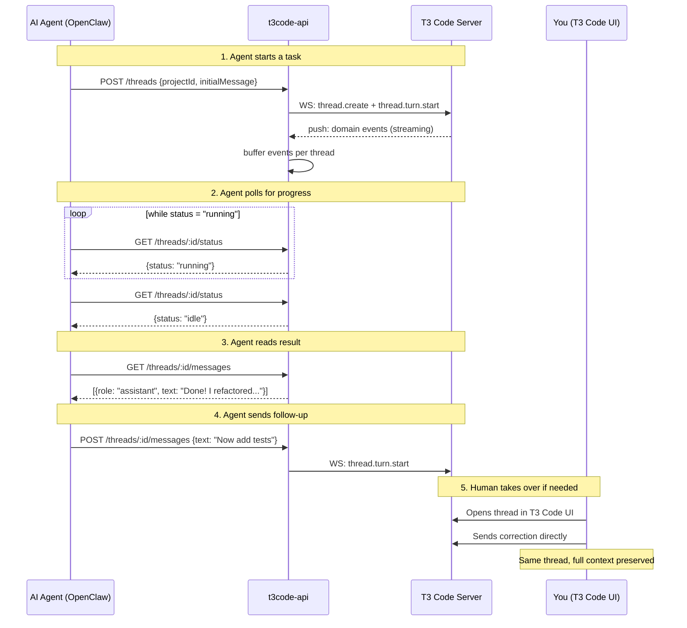
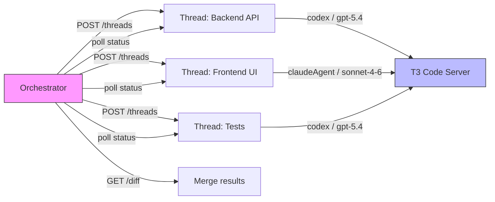

# t3code-api

**Give your AI agents full control over coding sessions — and step in when they need you.**

t3code-api is a REST bridge for [T3 Code](https://github.com/pingdotgg/t3code) that makes it trivial for AI agents (like [OpenClaw](https://github.com/openclaw), custom orchestrators, or CI pipelines) to spin up coding sessions, send tasks, monitor progress, and read results — all through plain HTTP.

The key idea: **your agents work in parallel, each in their own thread, while you keep full access to the same T3 Code session in the browser**. If an agent gets stuck or goes off track, you open the T3 Code UI, pick up the thread, and continue manually — no context lost, no restart needed.

## What this enables

- **Parallel agent execution** — run multiple AI agents simultaneously, each in a separate thread with its own working directory
- **Human-agent handoff** — agents work autonomously; you take over the T3 Code UI at any point to course-correct or finish the job
- **Any language, any framework** — your orchestrator just needs HTTP; no WebSocket protocol knowledge, no T3 Code SDK required
- **Provider flexibility** — switch between Codex (GPT-5.4) and Claude (Opus 4.6, Sonnet 4.6) per thread or even per message

```
┌──────────────┐     ┌──────────────┐     ┌──────────────┐
│  AI Agent 1  │     │  AI Agent 2  │     │   You (UI)   │
│  (OpenClaw)  │     │  (custom)    │     │  T3 Code web │
└──────┬───────┘     └──────┬───────┘     └──────┬───────┘
       │ HTTP               │ HTTP               │ WS
       ▼                    ▼                    ▼
┌─────────────────────────────────────────────────────────┐
│                     t3code-api                          │
│              REST ←→ WebSocket bridge                   │
│                  ┌─────────────────┐                    │
│                  │  event buffer   │                    │
│                  │  (per thread)   │                    │
│                  └─────────────────┘                    │
└─────────────────────────┬───────────────────────────────┘
                          │ WebSocket
                          ▼
               ┌─────────────────────┐
               │   T3 Code Server    │
               │  (codex / claude)   │
               └─────────────────────┘
```

## Workflow

A typical agent orchestration flow looks like this:



### Multi-agent parallel execution



Each thread runs independently with its own provider, model, and working directory. The orchestrator creates all threads, monitors progress, and collects results. If any agent struggles, a human can take over that specific thread in the T3 Code UI without disrupting the others.

## Quick start

```bash
bun install
bun run dev
```

The bridge connects to `ws://localhost:3773` (T3 Code's default port). Make sure T3 Code is running first.

Open `http://localhost:4774/docs` for interactive Swagger UI.

## How it works

1. On startup, the bridge opens a persistent WebSocket to the T3 Code server
2. It listens for `orchestration.domainEvent` push messages and buffers them per thread
3. Your app talks to the bridge over HTTP:
   - **Commands** (create thread, send message, interrupt) are forwarded to T3 Code via WebSocket
   - **Reads** (messages, events, status) are served from the in-memory event buffer — fast, no round-trip
4. The T3 Code web UI continues working normally — the bridge is just another WebSocket client, it doesn't interfere

Historical threads are hydrated from T3 Code's snapshot on demand, so you can read messages from threads that existed before the bridge started.

## Configuration

All settings via environment variables:

| Variable | Default | Description |
|----------|---------|-------------|
| `T3API_PORT` | `4774` | Port for the REST bridge |
| `T3API_WS_URL` | `ws://localhost:3773` | T3 Code WebSocket URL |
| `T3API_TOKEN` | _(none)_ | Bearer token for bridge auth (optional) |
| `T3API_MAX_EVENTS` | `500` | Max buffered events per thread |

```bash
T3API_PORT=4774 T3API_WS_URL=ws://localhost:3773 T3API_TOKEN=secret bun run dev
```

### Authentication

When `T3API_TOKEN` is set, all requests (except `/docs` and `/openapi.yaml`) require `Authorization: Bearer <token>`.

This is the bridge's own auth, independent of T3 Code's `--auth-token`.

## API endpoints

### Health & status

| Method | Path | Description |
|--------|------|-------------|
| `GET` | `/health` | Bridge health — connection status, last sequence number |
| `GET` | `/snapshot` | Full T3 Code state — all projects, threads, messages, sessions |
| `GET` | `/docs` | Swagger UI (no auth required) |
| `GET` | `/openapi.yaml` | OpenAPI 3.1 spec (no auth required) |

### Thread management

| Method | Path | Description |
|--------|------|-------------|
| `POST` | `/threads` | Create a new thread (optionally with first message) |
| `DELETE` | `/threads/:threadId` | Delete a thread |
| `GET` | `/threads/:threadId/status` | Current thread status (`idle`, `running`, etc.) |

### Messages & events

| Method | Path | Description |
|--------|------|-------------|
| `POST` | `/threads/:threadId/messages` | Send a message — starts a new agent turn |
| `GET` | `/threads/:threadId/messages` | Read accumulated messages (streaming deltas merged) |
| `GET` | `/threads/:threadId/events` | Raw domain events (filterable by type) |
| `POST` | `/threads/:threadId/interrupt` | Interrupt the current agent turn |
| `GET` | `/threads/:threadId/diff` | File diff — what the agent changed |

## Creating threads

```
POST /threads
```

```json
{
  "projectId": "uuid-from-snapshot",
  "title": "Refactor auth module",
  "provider": "codex",
  "model": "gpt-5.4",
  "runtimeMode": "full-access",
  "interactionMode": "default",
  "workdir": "/opt/projects/my-app",
  "initialMessage": {
    "text": "Refactor the auth middleware to use JWT",
    "attachments": [{ "type": "image", "path": "/tmp/current-flow.png" }]
  }
}
```

Only `projectId` is required. Everything else has sensible defaults:

| Field | Default | Description |
|-------|---------|-------------|
| `title` | `API Thread` | Display name in T3 Code UI |
| `provider` | `codex` | `codex` or `claudeAgent` |
| `model` | `gpt-5.4` | Model identifier (see providers table below) |
| `runtimeMode` | `full-access` | `full-access` or `approval-required` |
| `interactionMode` | `default` | `default` (execute immediately) or `plan` (plan first) |
| `workdir` | _(project root)_ | Working directory — useful for parallel agents on different repos |
| `initialMessage` | _(none)_ | Send the first message immediately on creation |

## Sending messages

```
POST /threads/:threadId/messages
```

```json
{
  "text": "Now add unit tests for the auth middleware",
  "attachments": [{ "type": "image", "path": "/tmp/screenshot.png" }]
}
```

Only `text` is required. Optional per-turn overrides: `provider`, `model`, `runtimeMode`, `interactionMode`, `attachments`.

Supported image formats: `.png`, `.jpg`, `.jpeg`, `.gif`, `.webp`, `.svg`, `.bmp`.

## Reading messages

```
GET /threads/:threadId/messages?after=42&limit=20
```

Returns accumulated messages with streaming deltas merged into single entries:

```json
{
  "messages": [
    { "messageId": "...", "role": "user", "text": "Refactor auth", "streaming": false },
    { "messageId": "...", "role": "assistant", "text": "I'll refactor the auth middleware...", "streaming": false }
  ],
  "lastSequence": 55
}
```

- `streaming: true` means the assistant is still generating — poll again to get more text
- Use `lastSequence` as `?after=` in the next request to get only new messages

## Polling for completion

```
GET /threads/:threadId/status
```

```json
{ "threadId": "...", "status": "idle" }
```

| Status | Meaning |
|--------|---------|
| `idle` | Ready for new messages |
| `starting` | Turn initializing |
| `running` | Agent actively working |
| `ready` | Waiting for input (e.g. approval) |
| `interrupted` | Turn was interrupted |
| `error` | Something went wrong — check events |
| `null` | No session events yet |

## Providers & models

| Provider | Value | Models | Description |
|----------|-------|--------|-------------|
| Codex (OpenAI) | `codex` | `gpt-5.4` | Code generation and execution via JSON-RPC |
| Claude Agent | `claudeAgent` | `claude-opus-4-6`, `claude-sonnet-4-6` | Autonomous coding with tool use |

## Domain event types

Filter with `GET /threads/:threadId/events?types=thread.session-set,thread.message-sent`:

| Event type | Description |
|------------|-------------|
| `thread.created` | Thread created |
| `thread.deleted` | Thread deleted |
| `thread.message-sent` | User or assistant message persisted |
| `thread.session-set` | Session status changed |
| `thread.turn-start-requested` | Turn requested (message submitted) |
| `thread.turn-diff-completed` | Turn finished, file diff available |
| `thread.activity-appended` | Activity log (tool calls, info, errors) |
| `thread.approval-response-requested` | Agent waiting for tool approval |
| `thread.meta-updated` | Thread metadata changed |
| `thread.proposed-plan-upserted` | Agent produced/updated a plan |

## Example: parallel agents with handoff

```bash
# Get project ID
PROJECT=$(curl -s http://localhost:4774/snapshot | jq -r '.projects[0].projectId')

# Agent 1: backend work
T1=$(curl -s -X POST http://localhost:4774/threads \
  -H 'Content-Type: application/json' \
  -d "{\"projectId\": \"$PROJECT\", \"workdir\": \"/opt/my-app\",
       \"initialMessage\": {\"text\": \"Add pagination to the /users endpoint\"}}" \
  | jq -r '.threadId')

# Agent 2: frontend work (runs in parallel)
T2=$(curl -s -X POST http://localhost:4774/threads \
  -H 'Content-Type: application/json' \
  -d "{\"projectId\": \"$PROJECT\", \"workdir\": \"/opt/my-app\",
       \"provider\": \"claudeAgent\", \"model\": \"claude-sonnet-4-6\",
       \"initialMessage\": {\"text\": \"Build a user list component with infinite scroll\"}}" \
  | jq -r '.threadId')

# Monitor both
for TID in $T1 $T2; do
  echo "Thread $TID: $(curl -s http://localhost:4774/threads/$TID/status | jq -r '.status')"
done

# Read results when done
curl -s "http://localhost:4774/threads/$T1/messages" | jq '.messages[-1].text'
curl -s "http://localhost:4774/threads/$T2/messages" | jq '.messages[-1].text'

# Agent 2 went off track? Open T3 Code UI, find the thread, continue manually.
# Or send a correction via API:
curl -X POST "http://localhost:4774/threads/$T2/messages" \
  -H 'Content-Type: application/json' \
  -d '{"text": "Use virtualized list instead of infinite scroll"}'
```

## Architecture

| File | Role |
|------|------|
| `src/index.ts` | Entry point — config, HTTP server, snapshot hydration on connect |
| `src/ws-client.ts` | Persistent WebSocket client with auto-reconnect and request/response matching |
| `src/event-buffer.ts` | Per-thread circular buffer — streaming accumulation, snapshot hydration |
| `src/routes.ts` | Hono REST routes — translates HTTP to WS commands and buffer reads |
| `src/openapi.yaml` | OpenAPI 3.1 spec — powers Swagger UI at `/docs` |

The bridge is stateless except for the event buffer (in-memory, lost on restart). T3 Code server is always the source of truth — use `GET /snapshot` to rebuild state after a bridge restart.

## Tech stack

- **Runtime**: [Bun](https://bun.sh)
- **HTTP**: [Hono](https://hono.dev) (minimal, Bun-native)
- **WebSocket**: Native `WebSocket` (Bun built-in)
- **Dependencies**: Only `hono` — intentionally minimal
